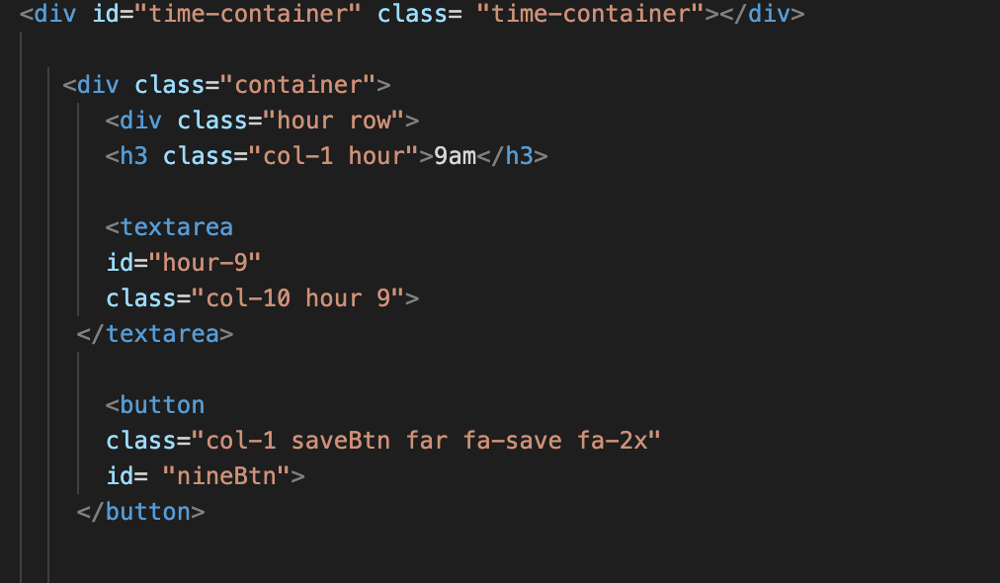
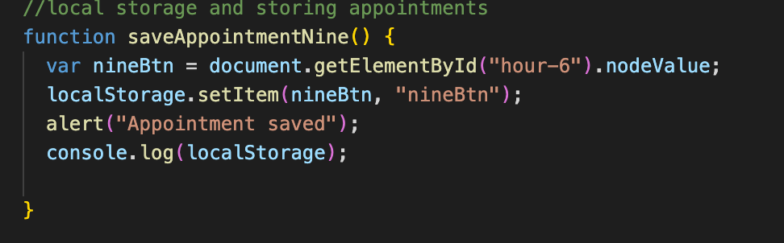

#Weekly Planner
 
Weekly Planner is a planning application that allows the user to be able to set appointments during regualar office hours and see what appointments are happening in the past,present and furture with a color coding system.

User Story:
AS AN employee with a busy schedule
I WANT to add important events to a daily planner
SO THAT I can manage my time effectively

Installation:
There is no installation required 

Strategy:

Using Moment JS, the current day will display as to improve the functionality of the planner 

Using Moment the current date is displayed at the time of the screen 

I created a time container with a button that is used to save the appointment to local storage 

Then in JavaScript a function was created for each that would save the appointment 

Color change for different time periods of past,present and future 